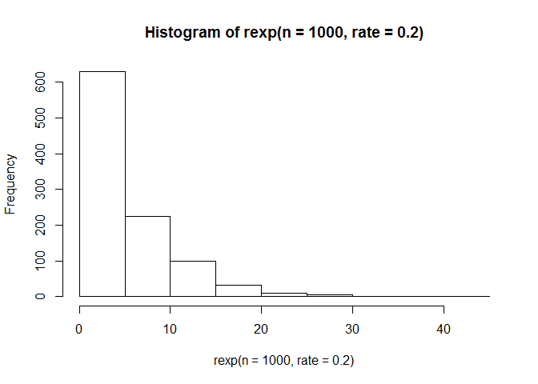
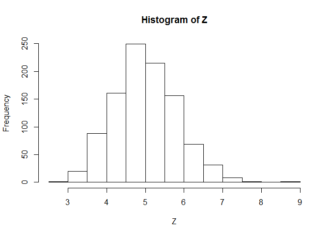

# A Simulation Exercise with the Exponential Distribution
Tim Wise  
February 21, 2015  

### Overview

### Simulations

For this analysis, we generate numbers from the exponential distribution.

####  The exponential distribution

The exponential distribution can be simulated in R with rexp(n, lambda) where lambda is the rate parameter. For this analysis, we set lambda = 0.2. The shape of the exponential distribution for lambda = 0.2 is shown below:

```r
hist(rexp(n=1000, rate=0.2))
```

 

The mean and variance of the exponential distribution are both 1 / lambda:

```r
lambda <- 0.2
mu <- 1 / lambda
sigma <- 1 / lambda
c(mu, sigma)
```

```
## [1] 5 5
```

#### Generate 1000 sets each with 40 exponentials

Now we generate 1000 sets of 40 random exponential numbers. We store those sets in a matrix, M, with 1000 rows, one for each set, and 40 columns, one for each member of the set:

```r
nsets <- 1000
nsamples <- 40
M <- matrix(data = rexp(n = nsets * nsamples, 
                        rate = lambda),
            nrow = nsets,
            ncol = nsamples)
str(M)
```

```
##  num [1:1000, 1:40] 4.397 2.955 4.511 3.515 0.616 ...
```

### Sample Means vs Theoretical Mean

We have learned in this class that:  
- the average of a random sample is itself a random variable, and  
- the distribution of that random variable is centered around the population mean, mu.

Let's see if we can show that for the exponential distribution. 

First, let's create a new random variable, Z, whose values are the average of a set of 40 exponentials. With the values in M, we can compute 1000 values for Z by taking the average of each row in M:

```r
summarize.rows <- 1
Z <- apply (M, summarize.rows, mean)
str(Z)
```

```
##  num [1:1000] 5.07 4.77 4.2 5.96 4.07 ...
```
Now, let's compare the sample mean of Z with mu, the theoretical mean of our exponential distribution:

```r
round(c(mu, mean(Z)), 2)
```

```
## [1] 5 5
```
We can see that the two compare very closely.

Let's visualize Z, looking at the distribution of values: 

```r
hist(Z)
```

 

The distribution of Z, the sample means, is centered around 5, which is the theoretical mean of our exponential distribution.

And the distribution of Z looks Guassian (normal) and quite a bit different from the exponential distribution we started with.

### Sample Variance versus Theoretical Variance


